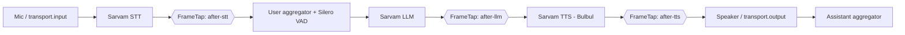

# Sarvam Voice Bot

A real-time, multilingual voice assistant built on [Pipecat](https://github.com/pipecat-ai/pipecat) and powered end to end by [Sarvam AI](https://www.sarvam.ai/). You talk to it in Hindi, English, Marathi or another Indian language, and it replies out loud in the same language.


---

## Features

- **Fully Indian-language stack.** Speech-to-text, the LLM and text-to-speech all run on Sarvam, so the bot handles Indian languages and code-mixed speech (like Hinglish) natively.
- **Same-language replies.** Speak in Marathi and it answers in Marathi; switch to English mid-conversation and it follows.
- **Natural turn-taking.** Silero VAD detects when you start and stop talking, so there's no push-to-talk button.
- **Runs in your browser.** Connects over WebRTC, so you can talk to it at `localhost` with no extra accounts or services.
- **Built-in pipeline debugging.** A custom `FrameTap` processor logs every frame flowing between stages, so you can see exactly where a conversation breaks.

---

## How it works

Pipecat models the bot as a pipeline: data moves through it as **frames**, and each stage is a **FrameProcessor** that receives frames, does one job, and pushes them on.



| Stage                | Component                                        | Job                                                                              |
| -------------------- | ------------------------------------------------ | -------------------------------------------------------------------------------- |
| Input                | `transport.input()`                              | Streams your microphone audio into the pipeline                                  |
| Speech-to-text       | `SarvamSTTService`                               | Turns speech into text and auto-detects the language                             |
| User aggregator      | `LLMContextAggregatorPair` + `SileroVADAnalyzer` | Waits until you finish speaking, then adds your turn to the conversation context |
| LLM                  | `SarvamLLMService` (`sarvam-105b-conversations`) | Generates a short, speech-friendly reply                                         |
| Text-to-speech       | `SarvamTTSService` (voice: `shubh`)              | Speaks the reply                                                                 |
| Output               | `transport.output()`                             | Plays the bot's voice in your browser                                            |
| Assistant aggregator | `LLMContextAggregatorPair`                       | Saves the bot's reply into the context so it remembers the conversation          |

When a client connects, the bot introduces itself first. When the client disconnects, the pipeline shuts down cleanly.

---

## Debugging with FrameTap

`FrameTap` is a pass-through processor: it logs the type (and text, if any) of every frame it sees, then forwards the frame unchanged. Three taps sit between the main stages.

Sample output from one conversational turn:

```
[after-stt] DOWN UserStartedSpeakingFrame
[after-stt] DOWN TranscriptionFrame | 'namaste, tum kaun ho?'
[after-stt] DOWN UserStoppedSpeakingFrame
[after-llm] DOWN LLMFullResponseStartFrame
[after-llm] DOWN LLMTextFrame | 'Namaste! '
[after-llm] DOWN LLMTextFrame | 'Main ek robot hoon.'
[after-llm] DOWN LLMFullResponseEndFrame
[after-tts] DOWN TTSStartedFrame
[after-tts] UP   BotStartedSpeakingFrame
[after-tts] DOWN TTSStoppedFrame
```

**Reading it:** if a tap goes silent, the stage right before it is the problem. For example, transcriptions appearing at `after-stt` with nothing at `after-llm` means the LLM call is failing.

By default the tap skips raw audio frames, which arrive around 50 times per second. To confirm audio is actually flowing, use:

```python
FrameTap("after-stt", skip_noisy=False)
```

Taps log at `DEBUG` level, so run with `LOGURU_LEVEL=DEBUG` if you don't see them.

---

## Project structure

```
.
├── bot.py            # Pipeline, Sarvam services and FrameTap
├── README.md
├── pyproject.toml    # Declared dependencies
├── uv.lock           # Exact pinned versions
├── .env              # Your API keys (not committed)
└── .gitignore
```

---

## Getting started

### Prerequisites

- Python 3.10+
- [uv](https://docs.astral.sh/uv/)
- A [Sarvam AI](https://www.sarvam.ai/) API key

### 1. Clone and install

```bash
git clone https://github.com/<your-username>/<repo-name>.git
cd <repo-name>
uv sync
```

`uv sync` installs the exact versions pinned in `uv.lock`.

### 2. Add your keys

Create a `.env` file in the project root:

```env
SARVAM_API_KEY=your_sarvam_key
```

### 3. Run

```bash
uv run bot.py
```

Open the URL printed in the terminal (usually `http://localhost:7860`), allow microphone access, and start talking.

For debug logs from the frame taps:

```bash
LOGURU_LEVEL=DEBUG uv run bot.py
```

---

## Customization

**Change the personality.** Edit `system_instruction` in `SarvamLLMService.Settings`. Keep the rule about avoiding special characters, since everything the LLM writes is spoken aloud.

**Change the voice.** Swap `voice="shubh"` in `SarvamTTSService.Settings` for another Sarvam voice.

**Lock the language.** STT auto-detects language by default. If all your users speak one language, setting an explicit language code (such as `hi-IN` or `mr-IN`) usually improves accuracy.

**Change the opening line.** Edit the message added in `on_client_ready`. By default it is `"Start by introducing yourself."`

**Inspect a new stage.** Drop a `FrameTap("your-label")` anywhere in the pipeline list.

---

## Troubleshooting

| Symptom                                     | Likely cause                                        | Fix                                                                                 |
| ------------------------------------------- | --------------------------------------------------- | ----------------------------------------------------------------------------------- |
| `NameError: name 'FrameTap' is not defined` | Class is defined below `if __name__ == "__main__":` | Move the class above `run_bot`                                                      |
| Bot never responds                          | Missing or invalid `SARVAM_API_KEY`                 | Check `.env` and confirm the key works                                              |
| Nothing at `after-stt`                      | Mic audio isn't reaching STT                        | Check browser mic permission; use `skip_noisy=False` to confirm audio frames arrive |
| Text at `after-llm` but no sound            | TTS failing                                         | Check the voice name and your Sarvam quota                                          |
| No FrameTap logs                            | Log level above DEBUG                               | Run with `LOGURU_LEVEL=DEBUG`                                                       |

---

## Tech stack

- [Pipecat](https://github.com/pipecat-ai/pipecat): real-time voice AI pipeline framework
- [Sarvam AI](https://www.sarvam.ai/): STT, LLM and TTS for Indian languages
- [Silero VAD](https://github.com/snakers4/silero-vad): voice activity detection
- WebRTC (via Pipecat's built-in transport): real-time audio in the browser
- [uv](https://docs.astral.sh/uv/): Python package management

---
